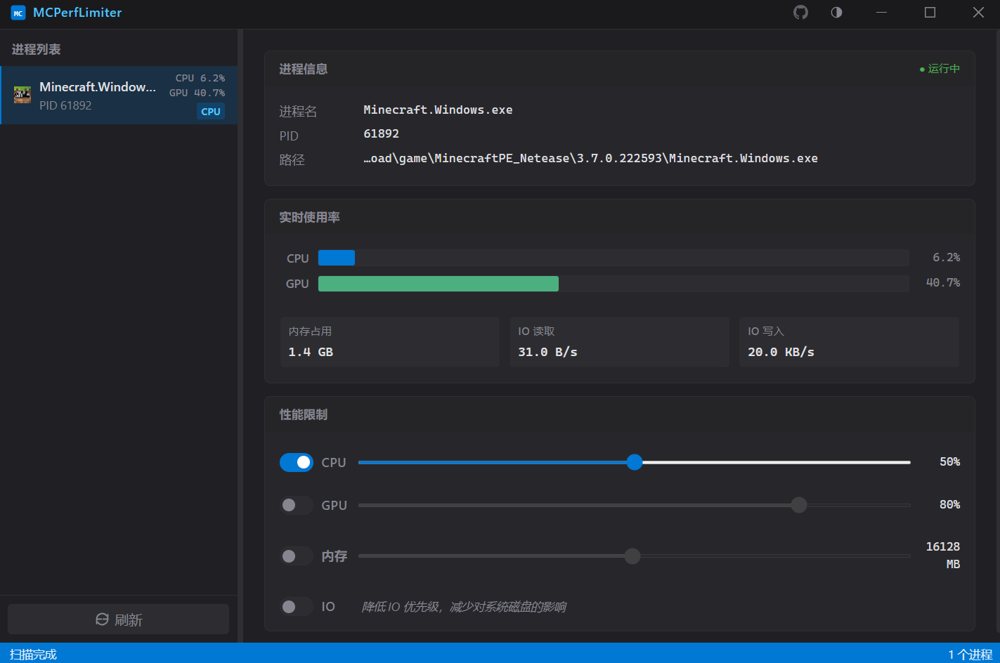

# MCPerfLimiter
一款专为Minecraft设计的性能限制工具，用于模拟低性能环境，帮助开发者测试和优化游戏性能。

## CPU限制
通过调节CPU亲和性和优先级，限制Minecraft使用的CPU资源，从而降低游戏性能。

## GPU限制
通过DLL注入和API Hook技术，限制Minecraft的GPU性能，模拟低性能GPU环境。

## 内存限制
通过调整进程的内存使用限制，模拟低内存环境（如IOS设备），帮助开发者测试游戏在内存受限情况下的表现。

## IO限制
通过限制磁盘IO速度，模拟低速存储设备环境，测试游戏在IO受限情况下的性能表现。